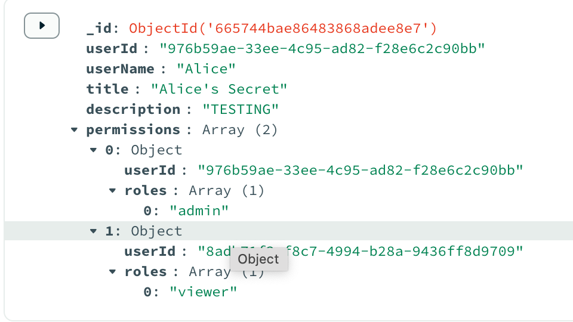

# Documentation for Authorization & Access Control Project

## The Initial Setup (Creating the Basic Web Application)

- In this initial setup, I am creating a basic CRUD application where users can manage their "`secrets`".
- In this intial setup, I am also setting up authentication and a basic level of access control with Role Based Access Control

## Authentication

- For the authentication, users can signup/login with their credentials. Here is the data flow of how a user signs up for the application.

1. On client side: user enters a username and password. Send this as a POST request to the server;'s endpoint: http://localhost:4000/registers/signup

- [File with code](../client/src/components/register/helpers/handleUser.ts)

```typescript
export async function handleSignup(userName: string, password: string) {
  // Now, send a request to backend to store username and hash password
  const options = {
    method: "POST",
    headers: {
      "Content-Type": "application/json",
    },
    body: JSON.stringify({
      userName,
      password,
    }),
  };
  const response = await fetch(
    "http://localhost:4000/registers/signup",
    options
  );
  if (!response.ok) {
    const errorData = await response.json();
    console.error("Backend registration failed", errorData);
    return errorData;
  } else {
    const responseData = await response.json();
    console.log("Backend Registration worked!: ", responseData);
    localStorage.setItem("token", responseData.token);
    return responseData;
  }
}
```

2. On Server, do the following:
   2a. Check the username is not taken by looking into the users schema on mongoDB.
   2b. If it is then send the message "username" is taken back to the client.

   2b. If it is not, then create the hashed password using bcrypt and salt.
   2c. Store this result in the user schema for the mongoDB database
   2d. Then create the JSON Web Token by signing with my application's JSON token key
   2e. Send created Auth token back to the client

- [File with Code](../server/routes/register.js)

```javascript
router.post("/signup", async (req, res) => {
  const { userName, password } = req.body;
  if (!userName || !password) {
    return res.status(400).send("Username and password required");
  }
  const user = await getUser(userName, "userId");
  if (user) {
    return res.status(401).json({
      code: "auth/username-taken",
      message:
        "Sorry, this username is taken. Please choose a different username.",
    });
  }

  try {
    const saltRounds = 10;
    const hashedPassword = await bcrypt.hash(password, saltRounds);
    const user = await addUser({ userName, hashedPassword }); // Add user to MongoDB Database
    // Create the JWT
    const token = jwt.sign(
      { userName: userName, userId: user.userId },
      process.env.TOKEN_KEY,
      {
        expiresIn: "1h",
      }
    );
    user.token = token;
    res.status(201).json(user);
  } catch (error) {
    res.status(500).send("Failed to create user: " + error.message);
    console.error("Failed to create user: ", error);
  }
});
```

3. Client stores this token in the local storage and is sent through the Header as an `Auth: Bearer ${token}` for every API request to our backend involving the CRUD operations for secrets or permissions

- In the following code I have setup the middleware to verify the JWT

  ```javascript
  // server.js
  //routes
  app.use("/secrets", authenticateUser, secrets);
  app.use("/permissions", authenticateUser, permissions);
  ```

  ```javascript
  export function authenticateUser(req, res, next) {
    const authHeader = req.headers["authorization"];
    const token = authHeader && authHeader.split(" ")[1];
    if (!token) {
      return res
        .status(401)
        .json({ message: "No token provided. Authorization denied." });
    } else {
      jwt.verify(token, process.env.TOKEN_KEY, (error, decoded) => {
        if (error) {
          return res.status(401).json({
            message: "Token is not valid.",
          });
        } else {
          req.user = decoded; // Assign decoded user to request object
          next();
        }
      });
    }
  }
  ```

- **Sidenote**:
  - **Cookies vs Local Storage vs DOM**: Where do I store my JWT? This was something I was concerned about as I wanted to ensure best practice, and I ultimatey
  - By storing the session state on the client side with JWT, the user is allowed to be loged in for a longer period of time (even if the browser is closed).
    I also found it very simple to **set** and **get** the token

## Access Control

- There were many ways to approach how this appliction could have implemented access control. However, the apporach I took made it easier to implement on the front-end and harder on the server side which might not have been ideal for this project putting a strong emphasis on security.

### My approach to Access Control

- **RBAC**: I chose Role-based Access control because of the straight-forward approach in assigning user's permissions based on their roles:
- The following roles are assigned to each secret in the web app where different roles can be assigned to any user. Similar to how google docs allows you to share permissions with other users.

  - `admin`: The user can read, write, update, and delete the secret. They can also assign privileges to other users
  - `editor`: The user can view and edit (update) the secret
  - `viewer`: The user can only view the secret.
  - `No roles assigned`: The user will not be allowed to perform any CRUD operation on it and it won't be listed on their secrets page.

- **Storing Permissions in MongoDB in the Secrets Collection**: I was conflicted on where I should store the permissions for users, however a simple approach for me to implement was to store the permissions as a property of the secrets object in MongoDB.

  - **The reason**: I chose this route because the permissions were connected with each secret. Since each secret can have different permisisons for any user in the web app, I felt that this approach would simplify the process of creating, updating, deleting, and verifying permissions on each secret.

  - 

  - **Side Note**: I also have the **roles** property as an array but I could make it as a string, since a user in my app only has one role. The only reason I didn't was in case I needed the flexibility of having multiple roles for some reason.

### Alternative Approaches I considered:

- **ABAC vs RBAC**: Due to the simplicity of my web application, I felt that assigning permissions based on roles would suffice to the requirements I had. However, there were times where the flexiblity of ABAC would have helped my project when assigning read/write access to the secrets.
- **Storing the permissions in the JWT**: For my small web application, this might have been possible with few permissions created. However, as the application grows, it would not seem feasible to store permissions for every secret for every user in the token.
- **Storing the permissions in the User Collection**: I debated on if I store the permissions for secrets in the user collection. The reason I didn't was because it was more complex to fetch all the permissions for a given secret.
  - However, it would be more simple to fetch all the secrets a user is able to perform `read`, `write`, etc. operations to.
  - On the back-end I wish I would have done this approach to simplify the process of verifying permissions before a CRUD Operation is made on the secret
  - On the front-end I am glad that I was able to access and read the permissions available for a given secret.

## Penetration Testing

### Problem 1: Server Logic implemented after Client

- Although I am a well rounded full-stack developer, I believe that my strengths lie in front-end development.
- This midset I had of working on the front-end before the back-end introduced a bug for a short period of time.

#### Problem 1: The Bug

- My initial and basic approach for assigning privilige access control on my app was to perform the front-end first.
  - EX: A user will not see the `edit` button if they are not assigned the role `editor` or `admin`
- While this was quick and easy to implement, it was extremely easy to perform server side operations by sending in a request that would grant my user `admin` role to a secret I didn't have access to.

1. Using [Boomerang](https://chromewebstore.google.com/detail/boomerang-soap-rest-clien/eipdnjedkpcnlmmdfdkgfpljanehloah?hl=en), I prepare to make a client side request to this endpoint: `http://localhost:4000/permissions`
2. Assign the JSON body
   - I assign this as my JSON body:
   ```json
   {
     "userId": "8adb71f3-f8c7-4994-b28a-9436ff8d9709", // My attacker's userID
     "secretId": "665744bae86483868adee8e7", // The secret being attacked
     "roles": ["admin"] // The role I am granting the attacker
   }
   ```
3. Assign the Header to my request:

   - Required because every request needs to verify the user is logged in.

   ```header
    {
        Authorization: bearer {JSON Web Token}
    }
   ```

4. Create the request:
   - Since there is no server side logic to verify the permissions of the user making the request, the change is successfully submitted and the attacker will now have `admin` privileges to the secret.

- - This was caused by not implementing any additional checks on the server side to verify a user's role when **reading**, **writing**, **deleting**, or **assigning roles** for a given secret.

### Problem 1: The Solution

- The solution to this bug was to implement the logic on the server side for every CRUD operation made to the permissions or secret to verify the user has the correct access to perform the given operation.

- Helper function to perform this check: ([File with the code](/server/helpers/generateJWT.js))

  ```javascript
  // Helper function to check user permissions for a specific secret
  export async function hasPermissionForSecret(
    userId,
    secretId,
    requiredRoles
  ) {
    // Fetch the secret object from the database
    const secret = await findSecret(secretId);

    if (!secret) {
      return false; // Secret not found
    }

    const userPermissions = secret.permissions.find((p) => p.userId === userId);
    if (!userPermissions) {
      return false; // No permissions found for this user
    }

    // Return true or false whether the user has the required roles
    return requiredRoles.some((role) => userPermissions.roles.includes(role));
  }
  ```

- Now in our express routes, we want to verify the user making the request has the permissions necessary for this request.

- [File with code](/server/routes/permission.js)

  ```javascript
  // Create Permissions for the Secret
  router.post("/", async (req, res) => {
    // Get the list of permissions: [{userId, roles: []}, ...]
    const permissionData = req.body;
    // Get the user ID of the user making the request
    const { userId } = req.user;
    try {
      // Check if the user making the request has "admin" privileges
      const isAuthorized = await hasPermissionForSecret(
        userId,
        permissionData.secretId,
        ["admin"]
      );
      if (!isAuthorized) {
        return res.status(403).json({
          message: "Access denied. You do not have the necessary permissions.",
        });
      }
      // If we get here, the user has admin privilegs so make the change to the database to modify the secret's permissions
      await managePermission(permissionData, "upsert"); // Include the user making the request
      res.json({ message: "Permissions updated successfully" });
    } catch (error) {
      res.status(500).send("Failed to update Permission: " + error.message);
      console.error("Failed to update Permission: ", error);
    }
  });
  ```

- For every route, we are implementing this check for permissions.

### Problem 1: Conclusion

- While implementing the logic for this bug, I realized that my approach to implementing **data-driven** features in web applications should start on the back-end.
- In the future, I will keep all the buttons for the users and work on implementing the logic to verify permissions.
- After this part is working, I will implement the front-end to view only the buttons available based on the user's role.
